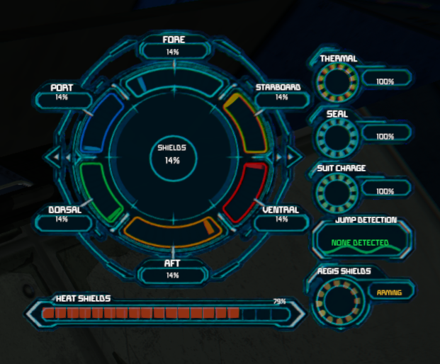
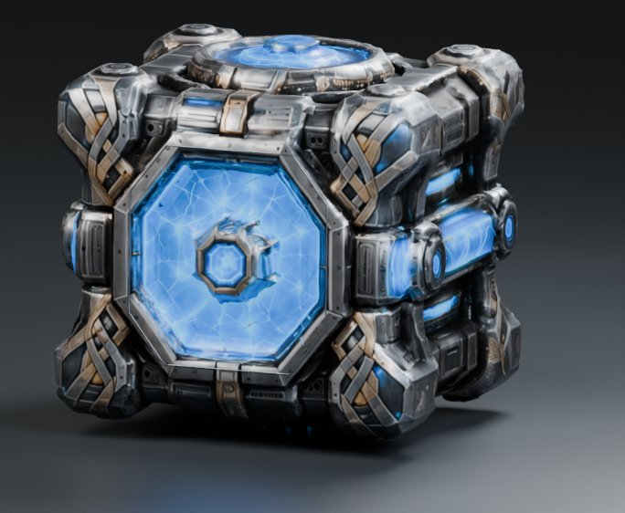
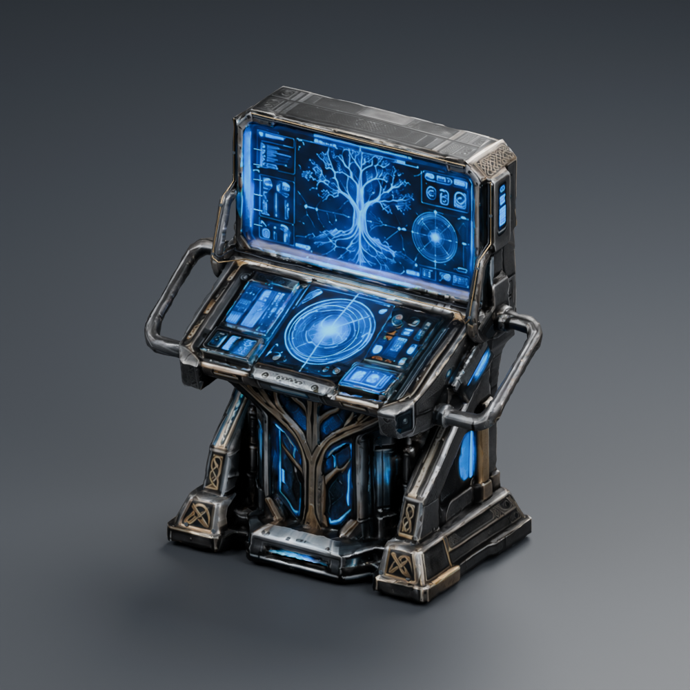
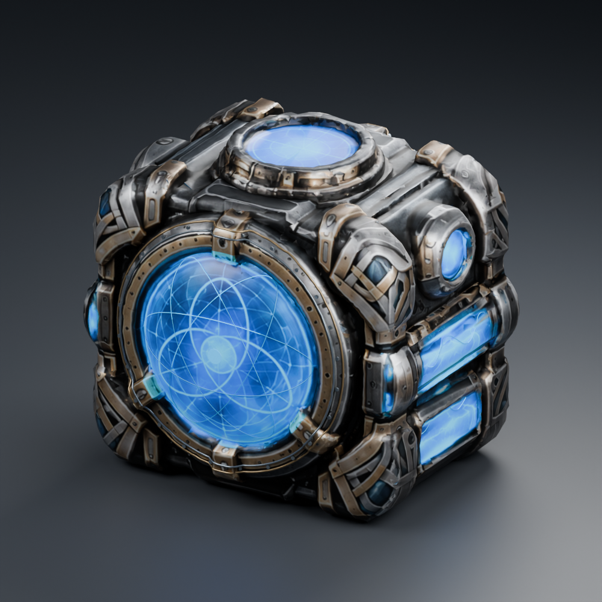
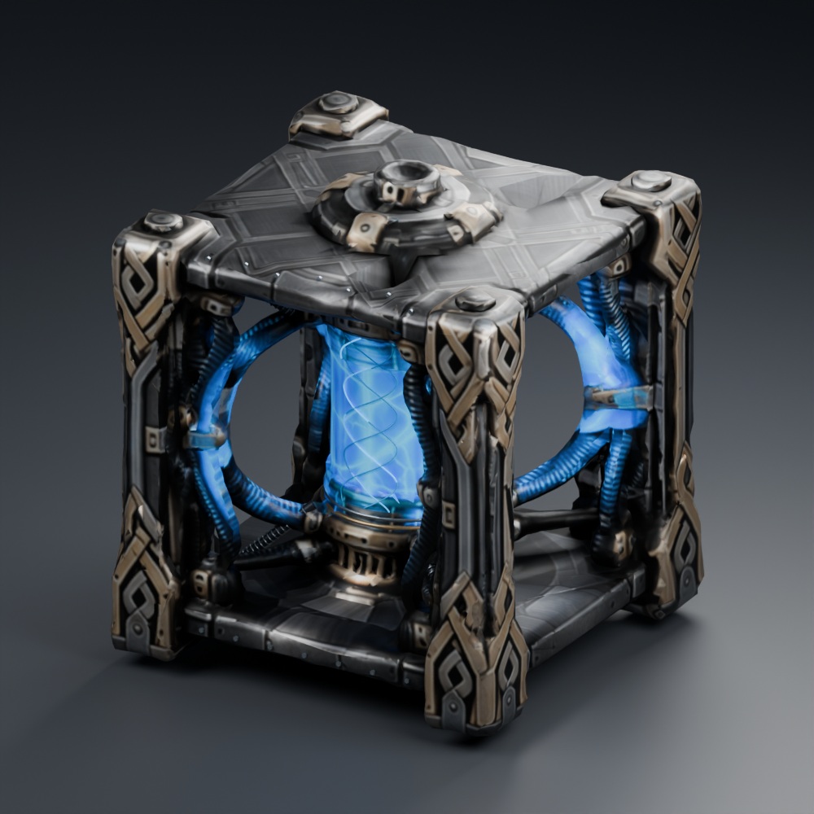
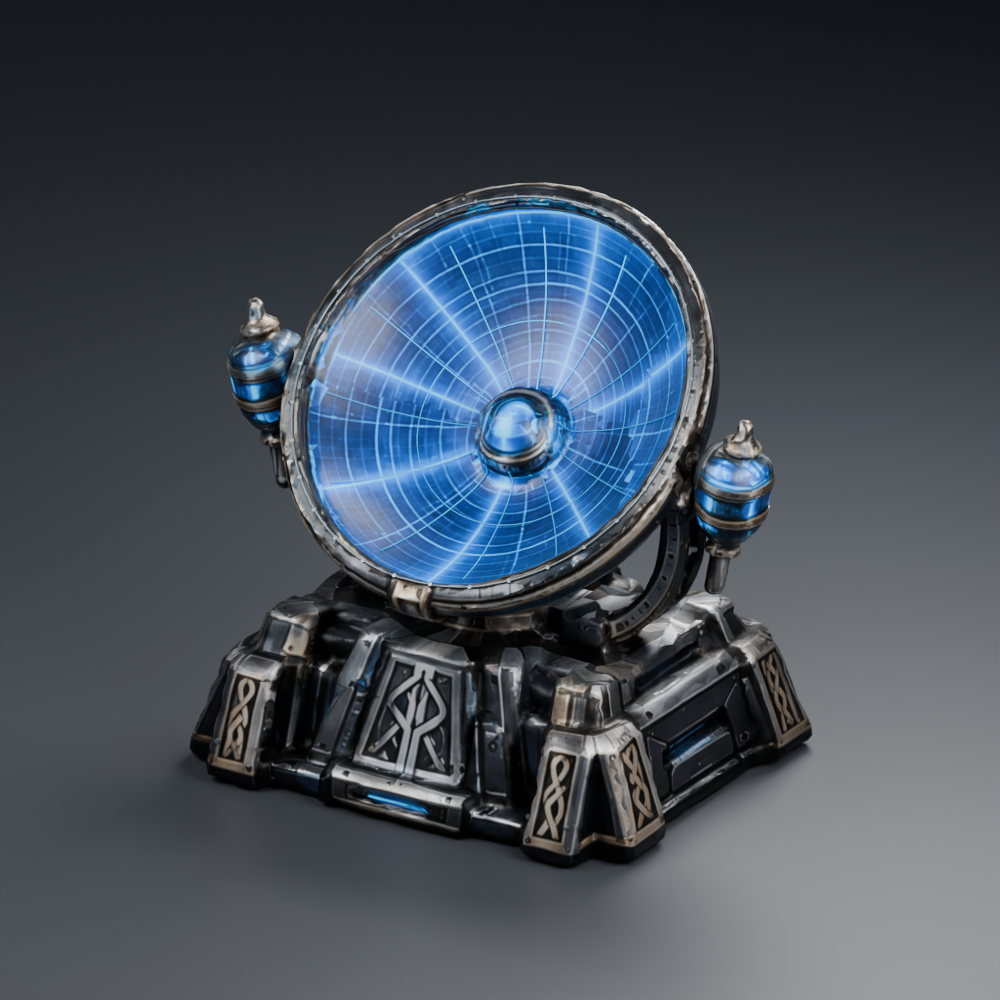
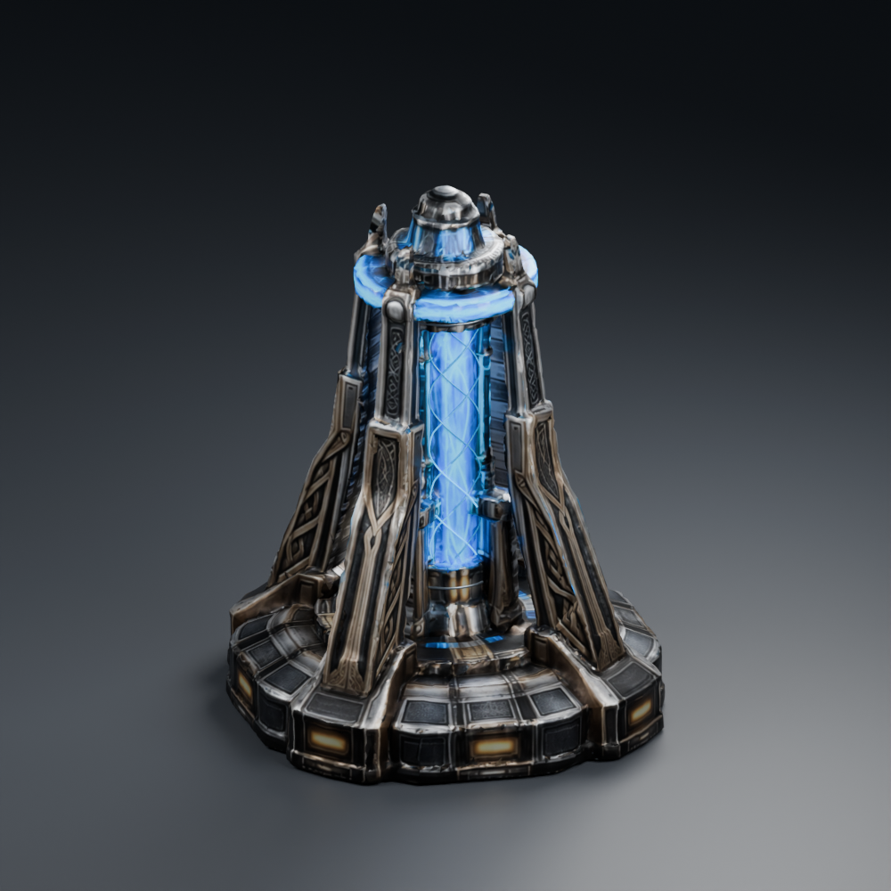

# TROA Aegis Bifrost Shield Array

**A modular shield, field-services, and jump-signature system for Space Engineers ships and stations.**

> **Status and accuracy:** This repository describes the private Alpha candidate and recent development work. It is a documentation-only public repository: no source code, private packages, test worlds, or development assets are published here. Automated validation confirms build/package integrity, not gameplay acceptance. The Steam Workshop pages are authoritative for the features, dependencies, compatibility, and release state of the versions players can download today.

## Get Aegis

- [TROA Aegis Bifrost Shield Array — Steam Workshop](https://steamcommunity.com/sharedfiles/filedetails/?id=3804076590)
- [TROA Aegis Visual Framework — Steam Workshop](https://steamcommunity.com/sharedfiles/filedetails/?id=3804071749)
- [Realms of Asgard — Space Engineers Gaming Hub](https://therealmsofasgard.com/gaming-hub/space-engineers)

Aegis has two cooperating Workshop components. **Bifrost Shield Array** owns authoritative shield gameplay, power, policy, services, and sensors. **Visual Framework** renders the Aegis HUD and client-only effects from read-only telemetry; it does not decide damage absorption or access permissions. Check the Workshop descriptions for load order, dependencies, current game compatibility, and installation steps.

## Shield system

Aegis tracks six directional shield banks—**Fore, Aft, Port, Starboard, Dorsal, and Ventral**—and the overall shield capacity. Supported incoming damage is mapped by impact direction and debited from the corresponding bank. Allocation and operating state are separate from the percentage readouts: a full-looking HUD graphic is not a substitute for confirming that the field is online and powered.

### Hardware roles

| Block | Role |
| --- | --- |
| **Aegis Core** | Construct shield authority, power allocation, access/field policy, survival services, and diagnostics. |
| **Bifrost Console** | Player-facing status and construct administration surface. |
| **Capacitor Rune** | Additional shield reserve and reserve allocation. |
| **Flux Weave** | Recharge allocation and emergency venting. |
| **Harmonic Modulator** | Shield profile selection and automatic tuning. |
| **Gjallarhorn Relay** | Coverage and directional reinforcement controls. |

Specialized controls are role-based; normal functional-block controls remain available. Ship and station setups have different geometry and hardware considerations. Use live Core status and the Workshop instructions to determine whether a particular construct is ready.

## Core settings and field policy

The current candidate replaces manual player/faction ID text boxes with named lists in the Core terminal:

- **Whitelist / Blacklist** mode.
- **Players, Factions, Grids, and Floating Objects** categories. Unsupported generic “Other Entities” (including voxel maps) are excluded from the filter UI and field interaction. Existing legacy `AllowedOtherEntityIds` data is ignored.
- Available and configured lists with **Add** and **Remove** actions. Lists refresh immediately when the mode/category changes or an entry is added/removed; reopening the terminal is not required.
- **Automatic Push/Pull** applies the supported filter at the server-side field boundary. Players, grids, and floating objects are the supported interaction targets; faction membership participates in access policy.
- A field boundary configurable from **0 to 200 m**. Wider configured coverage increases Core power demand; the field boundary is separate from the Atmosphere Seal clearance.

This is an Aegis-specific field policy, not full vanilla Safe Zone parity. The candidate does not expose cosmetic toggles for every action. Damage, shooting, drilling, welding, grinding, building, projections, voxel hands, and landing-gear locking each require supported enforcement hooks and separate acceptance before they can be advertised as configurable Safe Zone permissions.

## Power, damage, and weapon compatibility

Core allocation powers the shield and its services. Higher directional weights and wider configured service/field boundaries increase demand. The intended baseline for configurable Seal clearance is 10 m at 1.0×; the Seal multiplier scales to 2.0× at 200 m. Aegis reports operating/service state separately so players can tell whether a service is available rather than infer it from a static icon.

Shield absorption is intended to use one authoritative game damage-interception path. The WeaponCore selector controls supplemental hit observation; the available public WeaponCore bridge does not cancel weapon damage and must not be treated as a second shield-drain path. Vanilla and WeaponCore projectile coverage, edge cases, and absence of duplicate drain remain in-world acceptance items.

## Ship and station services

### Atmosphere Seal and Thermal protection

The powered Seal provides oxygen support and bounded thermal protection around eligible ships and stations. Its configurable clearance is **0–200 m**, is separate from the safe-field boundary, and raises power demand as it grows. Thermal protection covers supported temperature/freeze damage; neither service grants general damage immunity or replaces airtight room construction. Station and ship envelopes use different geometry. Confirm the live operating status before relying on life-support coverage.

### Suit Charge

Suit Induction reads player suit energy through the supported game API and can transfer charge from shield reserve when the field, authorization, reserve, and service conditions permit it. It consumes power and is not a static always-full indicator.

## HUD, effects, and LCDs

The companion Visual Framework renders a radial HUD from read-only shield snapshots. The intended live display includes:

- The six facing values and overall shield percentage, with labels/values centered to their areas.
- Heat level and Aegis operating state, separately represented (for example, offline/red, arming/yellow, online/green).
- Thermal, Seal, Suit Charge, Jump Detection, and AEGIS Shields service/status indicators.
- A visible animated wave for Jump Detection, shield-contact/absorption pulses, and a rainbow-like Heimdall path for detected jumps.

These client effects communicate state; they do not change shielding, authorization, or jump behavior. Aegis text surfaces offer Status, Compact, Combat, Matrix, and Off views. The two-surface Matrix configuration candidate is:

```ini
[TROA Aegis LCD]
Mode=Matrix
Layout=4x3
Tile=1/2
HUD=Off
```

Set the paired surface to `Tile=2/2`. `HUD=Off` suppresses the local HUD for that surface configuration; it does not disable shield simulation. The Matrix is intended to reflect current shield damage, recharge, service, and status telemetry. Validate panel sizing, split layouts, reconnect behavior, and multiplayer displays in-game.

## Jump Detection, Drive Signatures, and GPS

Aegis distinguishes two custom sensor signals:

1. **Jump signatures** are recorded when an observed loaded grid with a jump drive moves at least 1 km between server observations. Signal strength is bounded and factors in grid size, physical mass, and observed displacement. This detects an observed jump; it does not predict charge-up or control the jump.
2. **Drive Signatures** use measured current thrust as a heat-output proxy. They refresh while the ship is thrusting and stop refreshing when it is not. This is not engine-temperature telemetry and is not a native Space Engineers drive-signature feature.

Powered, working/broadcasting receiver antennas extend **Aegis's custom detection range** (up to a 125 km antenna bonus and a 250 km total cap). A vanilla antenna alone does not perform this signature scan. Recent jump-signature information is retained for up to **three minutes**.

When a jump is detected, players within **10 km** of the grid's last-known position are targeted for a persistent, HUD-visible GPS marker (`AEGIS Jump Grid — <grid name>`) and a HUD notification that the grid GPS was added. Same-location duplicate markers are suppressed. Multiplayer delivery, exact radius behavior, notification display, and GPS persistence require in-game confirmation.

**Realms of Asgard website map publishing is not connected.** Aegis does not upload jump pins or player coordinates to the website. That requires an agreed map ingest/authentication interface and privacy-safe approximate-location rules; credentials do not belong in the mod.

## Visual guide

The HUD image below is an in-game screenshot. Hardware images are rendered design previews, not in-game block screenshots.

### Shield HUD in game



### Hardware family

| Block | What it does | Design preview |
| --- | --- | --- |
| Aegis Core | Shield authority, administration, access/field settings, services, diagnostics. |  |
| Bifrost Console | Player-facing status and administration. |  |
| Capacitor Rune | Shield reserve capacity/allocation. |  |
| Flux Weave | Recharge allocation and emergency venting. |  |
| Harmonic Modulator | Shield profile and automatic tuning. |  |
| Gjallarhorn Relay | Coverage and directional reinforcement. |  |

## Current validation and known limits

The private candidate passes automated model/XML checks, game-assembly compilation, deterministic tests, and package-integrity validation. These checks prove that code compiles and packages validate; they do **not** certify gameplay or multiplayer behavior. In-world acceptance remains open for shield drain across weapon families, WeaponCore parity, filter permissions and pushback, ship/station life support and service power, HUD/LCD scaling and synchronization, jump/GPS radius and notifications, and dedicated-server performance.

The public Workshop release may not include private Alpha-candidate behavior. This repository does not announce a new Workshop release. See the [roadmap](ROADMAP.md), [changelog](CHANGELOG.md), [security policy](SECURITY.md), and [license](LICENSE.md). Older project notes are historical/legacy context; the Workshop pages define the current player-facing release.

## Documentation

See [`docs/README.md`](docs/README.md) for a guide to the system, Workshop installation source, candidate limits, and the distinction between authoritative gameplay and client visuals.
